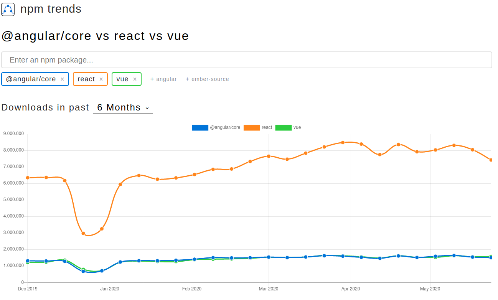

# Aula 01

## Links úteis

* <https://github.com/kamranahmedse/developer-roadmap>
* <https://github.com/enaqx/awesome-react>
* <https://create-react-app.dev>
* <https://codepen.io/pen/>
* [Projeto Final](https://github.com/juninmd/unifacef-react-typescript)

## Ementa

* Revisão dos Conceitos WEB
  * Exercícios HTML
  * Exercícios JavaScript + DOM
  * Exercícios CSS
  * Criando primeiro Projeto
  * Configurando o projeto com novas bibliotecas
    * Axios
    * React Router
    * MobX
    * Semantic UI React
    * Variáveis de Ambiente
    * Tratativas de Erro

## HTML


É a sigla de HyperText Markup Language, expressão inglesa que significa "Linguagem de Marcação de Hipertexto". Consiste em uma linguagem de marcação utilizada para produção de páginas na web, que permite a criação de documentos que podem ser lidos em praticamente qualquer tipo de computador e transmitidos pela internet.

Para escrever documentos HTML não é necessário mais do que um editor de texto simples e conhecimento dos códigos que compõem a linguagem. Os códigos (conhecidos como tags) servem para indicar a função de cada elemento da página Web. Os tags funcionam como comandos de formatação de textos, formulários, links (ligações), imagens, tabelas, entre outros.

Os browsers (navegadores) identificam as tags e apresentam a página conforme está especificada. Um documento em HTML é um texto simples, que pode ser editado no Bloco de Notas (Windows) ou Editor de Texto (Mac) e transformado em hipertexto.

---

## JavaScript


É uma linguagem de programação criada em 1995 por Brendan Eich enquanto trabalhava na Netscape Communications Corporation. Originalmente projetada para rodar no Netscape Navigator, ela tinha o propósito de oferecer aos desenvolvedores formas de tornar determinados processos de páginas web mais dinâmicos, tornando seu uso mais agradável. Um ano depois de seu lançamento, a Microsoft portou a linguagem para seu navegador, o que ajudou a consolidar a linguagem e torná-la uma das tecnologias mais importantes e utilizadas na internet.

---

## CSS3


É a sigla para o termo em inglês Cascading Style Sheets que, traduzido para o português, significa Folha de Estilo em Cascatas. O CSS é fácil de aprender e entender e é facilmente utilizado com as linguagens de marcação HTML ou XHTML.

---

## Web Developer Roadmap


Podemos ver que hoje em dia Frontend pode ter muitas vertentes, totalmente diferente do que poderíamos ver alguns anos atrás.

---

## React


* Uma biblioteca JavaScript para criar interfaces de usuário

Como definido por seus criadores, React é “uma biblioteca JavaScript declarativa, eficiente e flexível para a criação de interfaces de usuário (UI)”.

Essa biblioteca surgiu em 2011, no Facebook, e passou a ser utilizada na interface do mural de notícias da rede social.

No ano seguinte, passou a integrar também a área de tecnologia do Instagram e de várias outras ferramentas da empresa. Em 2013, o código foi aberto para a comunidade, o que colaborou para sua grande popularização.

## Comparação de Tecnologias



Podemos ver que está bem estável hoje em dia a quantidade de Downloads na npm.

### Ecosistema React


Algum exemplo de ecossistema React separando as bibliotecas com suas devidas responsabilidades.

Os gerenciadores de estados mais comuns são Redux e MobX.

## Create React App


É o cliente disponível pelo Facebook

Por exemplo na criação usamos o seguinte comando:

```bash
npx create-react-app my-app
```

Após isso navegue a pasta criada

```bash
cd my-app
```

Assim para iniciar o projeto é só executar o:

```bash
npm start
```

Se você já instalou o create-react-app global via npm, com o comando

```bash
npm install -g create-react-app
```

Você pode desinstalar usando o comando

```bash
npm uninstall -g create-react-app
```

Lembrando que você precisa ter o `Node >= 8.10` instalado na sua máquina, recomendo que utilize o `nvm` caso esteja no (macOS/Linux) ou `nvm-windows` para escolher as versões do node.

você pode instalar no Linux com

```bash
curl -o- https://raw.githubusercontent.com/nvm-sh/nvm/v0.35.3/install.sh | bash
```

<https://github.com/nvm-sh/nvm>

Caso seja Windows

<https://github.com/coreybutler/nvm-windows/releases/download/1.1.7/nvm-setup.zip>

No repositório

<https://github.com/nvm-sh/nvm>

## Templates

Você pode opcionalmente criar um projeto usando um template, caso não escolha algum
será escolhido o template base comum.

Você poderá pesquisar um no npm pesquisando por `cra-template-*` no npm <https://www.npmjs.com/search?q=cra-template-*>

```bash
npx create-react-app my-app --template [template-name]
```

Caso queira utilizar o template oficial `TypeScript` do create react app

```bash
npx create-react-app my-app --template typescript
```

Ao criar o projeto você ira obter a seguinte raiz de objetos

```bash
my-app
├── README.md
├── node_modules
├── package.json
├── .gitignore
├── public
│   ├── favicon.ico
│   ├── index.html
│   ├── logo192.png
│   ├── logo512.png
│   ├── manifest.json
│   └── robots.txt
└── src
    ├── App.css
    ├── App.js
    ├── App.test.js
    ├── index.css
    ├── index.js
    ├── logo.svg
    └── serviceWorker.js
```

## Scripts

Para iniciar o projeto você poderá iniciar pelo comando

```bash
npm start
```

ou

```bash
 yarn start
```

Podemos iniciar Testes através do comando

```bash
npm test
```

ou

```bash
yarn test
```

Para empacotar uma versão de produção, podemos utilizar o comando a seguir, esse comando irá gerar uma pasta chamada `build`, nela o create-react-app irá fornecer uma versão otimizada para a melhor performance possível. O build minifica seu código, deixando ele mais leve ao ser feito download e deixa pronto para ser hospedado.

```bash
npm run build
```

ou

```bash
yarn build
```

Para ejetar todo código por baixo dos panos do create-react-app você poderá utilizar o seguinte comando abaixo, lembrando que esse comando não tem volta, uma vez feito isso o código não será desfeito.
Irá modificar todo seu projeto gerando novas dependencias no arquivo `package.json` e criando novos arquivos de configuração do webpack por exemplo. Porém você poderá modificar algumas coisas que são fechadas por padrão.

```bash
npm run eject
```

ou

```bash
yarn eject
```

## Navegadores suportados

Por padrão, os projetos gerados suportam todos os navegadores modernos, para suportar Internet Explorer 9, 10, e 11 será requerido o uso de polyfills.
Para suportar navegadores antigos, utilize a biblioteca `react-app-polyfill`.

Um polyfill é um pedaço de código (geralmente JavaScript na Web) usado para fornecer funcionalidades modernas em navegadores mais antigos que não o suportam nativamente.

Por exemplo, um polyfill pode ser usado para imitar a funcionalidade de um elemento HTML Canvas no Microsoft Internet Explorer 7, usando um plugin Silverlight, ou imitar o suporte para unidades rem CSS, ou text-shadow, ou o que você quiser.

<https://developer.mozilla.org/pt-BR/docs/Glossario/Polyfill>

Exemplos de funcionalidades prontas para serem utilizadas

```bash
Exponentiation Operator (ES2016).
Async/await (ES2017).
Object Rest/Spread Properties (ES2018).
Dynamic import() (stage 4 proposal)
Class Fields and Static Properties (part of stage 3 proposal).
JSX, Flow and TypeScript.
```

Através do `browserslist` você pode definir o foco dos navegadores escolhidos editando esse arquivo no `package.json`.

## Lib vs CLI

- create-react-app
  command-line utility utilizado para criação de novos projetos.

- react-scripts
  É a dependencia de desenvolvimento comum nos projetos gerados usando o `create-react-app`.

## Linter

Por padrão os projetos são criados com o ESLint.

## Webpack


É um empacotador de código para projetos web. O que ele se propõe a fazer é focar em módulos da sua aplicação.
Nem sempre ter todo e qualquer JavaScript/CSS do seu projeto num único arquivo é bom, por isso o webpack tem a ideia de code splitting,
onde você modulariza partes reaproveitáveis do seu projeto, facilitando o desenvolvimento independente,
por exemplo, ter uma equipe trabalhando em um módulo X e outra num módulo Y, mas ambos de um mesmo projeto.

--

## Hello World

O menor exemplo de React é algo assim:

```jsx
ReactDOM.render(
  <h1>Hello, world!</h1>,
  document.getElementById('root')
);
```

Isso mostra um header dizendo “Hello, world!” na página.

---

## Introduzindo JSX

Considere esta declaração de variável:

```jsx
const element = <h1>Hello, world!</h1>;
```

Esta sintaxe estranha de tags não é uma string, nem HTML.

É chamada JSX e é uma extensão de sintaxe para JavaScript. Recomendamos usar JSX com o React para descrever como a UI deveria parecer. JSX pode lembrar uma linguagem de template, mas que vem com todo o poder do JavaScript.

JSX produz “elementos” do React. Nós iremos explorar a renderização para o DOM na próxima seção. Abaixo você descobrirá o básico de JSX necessário para começar.
Por que JSX?

O React adota o fato de que a lógica de renderização é inerentemente acoplada com outras lógicas de UI: como eventos são manipulados, como o state muda com o tempo e como os dados são preparados para exibição.

Ao invés de separar tecnologias artificialmente colocando markup e lógica em arquivos separados, o React separa conceitos com unidades pouco acopladas chamadas “componentes” que contém ambos. Voltaremos aos componentes em outra seção. Mas, se você ainda não está confortável em usar markup em JS, esta palestra pode convencer você do contrário.

No exemplo abaixo, declaramos uma variável chamada name e então a usamos dentro do JSX ao envolvê-la com chaves:

```jsx
const name = 'Josh Perez';const element = <h1>Hello, {name}</h1>;
ReactDOM.render(
  element,
  document.getElementById('root')
);
```

Você pode inserir qualquer expressão JavaScript válida dentro das chaves em JSX. Por exemplo, 2 + 2, user.firstName, ou formatName(user) são todas expressões JavaScript válidas.

No exemplo abaixo, incorporamos o resultado da chamada de uma função JavaScript, formatName(user), dentro de um elemento.

```html
<h1>Hello</h1>
```

Criamos uma função

```jsx
function formatName(user) {
  return user.firstName + ' ' + user.lastName;
}
```

```jsx
const user = {
  firstName: 'Harper',
  lastName: 'Perez'
};
```

```jsx
const element = (
  <h1>
    Hello, {formatName(user)}!  </h1>
);
```

```jsx
ReactDOM.render(
  element,
  document.getElementById('root')
);
```

Separamos o JSX em múltiplas linhas para melhorar a legibilidade. Mesmo que não seja obrigatório, quando fizer isso, também recomendamos colocar dentro de parênteses para evitar as armadilhas da inserção automática de ponto-e-vírgula.
JSX Também é uma Expressão

Depois da compilação, as expressões em JSX se transformam em chamadas normais de funções que retornam objetos JavaScript.

Isto significa que você pode usar JSX dentro de condições if e laços for, atribuí-lo a variáveis, aceitá-lo como argumentos e retorná-los de funções:

```jsx
function getGreeting(user) {
  if (user) {
    return <h1>Hello, {formatName(user)}!</h1>;  }
  return <h1>Hello, Stranger.</h1>;}
```

Especificando Atributos com JSX

Você pode usar aspas para especificar strings literais como atributos:

```jsx
const element = <div tabIndex="0"></div>;
```

Você também pode usar chaves para incorporar uma expressão JavaScript em um atributo:

```jsx
const element = </img>;
```

Especificando Elementos Filhos com JSX

Se uma tag está vazia, você pode fechá-la imediatamente com />, como XML:

```jsx
const element = ;
```

Tags JSX podem conter elementos filhos:

```jsx
const element = (
  <div>
    <h1>Hello!</h1>
    <h2>Good to see you here.</h2>
  </div>
);
```

JSX Previne Ataques de Injeção

É seguro incorporar entradas de usuário em JSX:

```jsx
const title = response.potentiallyMaliciousInput;
// This is safe:
const element = <h1>{title}</h1>;
```

Por padrão, o React DOM escapa quaisquer valores incorporados no JSX antes de renderizá-los. Assim, assegura que você nunca injete algo que não esteja explicitamente escrito na sua aplicação. Tudo é convertido para string antes de ser renderizado. Isso ajuda a prevenir ataques XSS (cross-site-scripting).
JSX Representa Objetos

O Babel compila JSX para chamadas React.createElement().

Estes dois exemplos são idênticos:

```jsx
const element = (
  <h1 className="greeting">
    Hello, world!
  </h1>
);
```

```jsx
const element = React.createElement(
  'h1',
  {className: 'greeting'},
  'Hello, world!'
);
```

React.createElement() realiza algumas verificações para ajudar você a criar um código sem bugs, mas, essencialmente, cria um objeto como este:

```jsx
// Nota: esta estrutura está simplificada
const element = {
  type: 'h1',
  props: {
    className: 'greeting',
    children: 'Hello, world!'
  }
};
```

Estes objetos são chamados “Elementos React”. Você pode imaginá-los como descrições do que você quer ver na tela. O React lê esses objetos e os usa para construir o DOM e deixá-lo atualizado.

---

## Visual Studio Code

```text
Debugger for Chrome
```

Abra o seu arquivo `launch.json` e copie esse conteúdo dentro para habilitar a depuração pelo chrome.

```jsx
{
  "version": "0.2.0",
  "configurations": [
    {
      "name": "Chrome",
      "type": "chrome",
      "request": "launch",
      "url": "http://localhost:3000",
      "webRoot": "${workspaceFolder}/src",
      "sourceMapPathOverrides": {
        "webpack:///src/*": "${webRoot}/*"
      }
    }
  ]
}
```

Você poderá iniciar o projeto através do atalho F5.

Caso tenha algum problema, poderá acessar esse Link:

<https://github.com/Microsoft/vscode-chrome-debug/blob/master/README.md#troubleshooting>

