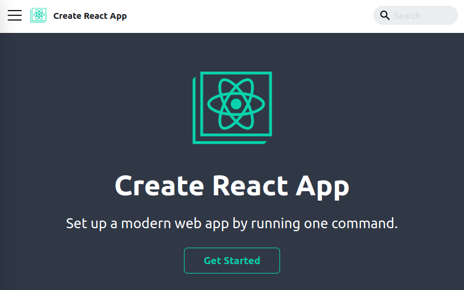

# Client

## Create React App



É o cliente disponível pelo Facebook

Por exemplo na criação usamos o seguinte comando:

```bash
npx create-react-app my-app
```

Após isso navegue a pasta criada

```bash
cd my-app
```

Assim para iniciar o projeto é só executar o:

```bash
npm start
```

Se você já instalou o create-react-app global via npm, com o comando

```bash
npm install -g create-react-app
```

Você pode desinstalar usando o comando

```bash
npm uninstall -g create-react-app
```

Lembrando que você precisa ter o `Node >= 8.10` instalado na sua máquina, recomendo que utilize o `nvm` caso esteja no (macOS/Linux) ou `nvm-windows` para escolher as versões do node.

você pode instalar no Linux com

```bash
curl -o- https://raw.githubusercontent.com/nvm-sh/nvm/v0.35.3/install.sh | bash
```

<https://github.com/nvm-sh/nvm>

Caso seja Windows

<https://github.com/coreybutler/nvm-windows/releases/download/1.1.7/nvm-setup.zip>

No repositório

<https://github.com/nvm-sh/nvm>

## Templates

Você pode opcionalmente criar um projeto usando um template, caso não escolha algum
será escolhido o template base comum.

Você poderá pesquisar um no npm pesquisando por `cra-template-*` no npm <https://www.npmjs.com/search?q=cra-template-*>

```bash
npx create-react-app my-app --template [template-name]
```

Caso queira utilizar o template oficial `TypeScript` do create react app

```bash
npx create-react-app my-app --template typescript
```

Ao criar o projeto você ira obter a seguinte raiz de objetos

```bash
my-app
├── README.md
├── node_modules
├── package.json
├── .gitignore
├── public
│   ├── favicon.ico
│   ├── index.html
│   ├── logo192.png
│   ├── logo512.png
│   ├── manifest.json
│   └── robots.txt
└── src
    ├── App.css
    ├── App.js
    ├── App.test.js
    ├── index.css
    ├── index.js
    ├── logo.svg
    └── serviceWorker.js
```

## Scripts

Para iniciar o projeto você poderá iniciar pelo comando

```bash
npm start
```

ou

```bash
 yarn start
```

Podemos iniciar Testes através do comando

```bash
npm test
```

ou

```bash
yarn test
```

Para empacotar uma versão de produção, podemos utilizar o comando a seguir, esse comando irá gerar uma pasta chamada `build`, nela o create-react-app irá fornecer uma versão otimizada para a melhor performance possível. O build minifica seu código, deixando ele mais leve ao ser feito download e deixa pronto para ser hospedado.

```bash
npm run build
```

ou

```bash
yarn build
```

Para ejetar todo código por baixo dos panos do create-react-app você poderá utilizar o seguinte comando abaixo, lembrando que esse comando não tem volta, uma vez feito isso o código não será desfeito.
Irá modificar todo seu projeto gerando novas dependencias no arquivo `package.json` e criando novos arquivos de configuração do webpack por exemplo. Porém você poderá modificar algumas coisas que são fechadas por padrão.

```bash
npm run eject
```

ou

```bash
yarn eject
```

## Navegadores suportados

Por padrão, os projetos gerados suportam todos os navegadores modernos, para suportar Internet Explorer 9, 10, e 11 será requerido o uso de polyfills.
Para suportar navegadores antigos, utilize a biblioteca `react-app-polyfill`.

Um polyfill é um pedaço de código (geralmente JavaScript na Web) usado para fornecer funcionalidades modernas em navegadores mais antigos que não o suportam nativamente.

Por exemplo, um polyfill pode ser usado para imitar a funcionalidade de um elemento HTML Canvas no Microsoft Internet Explorer 7, usando um plugin Silverlight, ou imitar o suporte para unidades rem CSS, ou text-shadow, ou o que você quiser.

<https://developer.mozilla.org/pt-BR/docs/Glossario/Polyfill>

Exemplos de funcionalidades prontas para serem utilizadas

```bash
Exponentiation Operator (ES2016).
Async/await (ES2017).
Object Rest/Spread Properties (ES2018).
Dynamic import() (stage 4 proposal)
Class Fields and Static Properties (part of stage 3 proposal).
JSX, Flow and TypeScript.
```

Através do `browserslist` você pode definir o foco dos navegadores escolhidos editando esse arquivo no `package.json`.

## Visual Studio Code

```text
Debugger for Chrome
```

Abra o seu arquivo `launch.json` e copie esse conteúdo dentro para habilitar a depuração pelo chrome.

```jsx
{
  "version": "0.2.0",
  "configurations": [
    {
      "name": "Chrome",
      "type": "chrome",
      "request": "launch",
      "url": "http://localhost:3000",
      "webRoot": "${workspaceFolder}/src",
      "sourceMapPathOverrides": {
        "webpack:///src/*": "${webRoot}/*"
      }
    }
  ]
}
```

Você poderá iniciar o projeto através do atalho F5.

Caso tenha algum problema, poderá acessar esse Link:

<https://github.com/Microsoft/vscode-chrome-debug/blob/master/README.md#troubleshooting>

---

## Lib vs CLI

- create-react-app
  command-line utility utilizado para criação de novos projetos.

- react-scripts
  É a dependencia de desenvolvimento comum nos projetos gerados usando o `create-react-app`.

## Linter

Por padrão os projetos são criados com o ESLint.

## Webpack


É um empacotador de código para projetos web. O que ele se propõe a fazer é focar em módulos da sua aplicação.
Nem sempre ter todo e qualquer JavaScript/CSS do seu projeto num único arquivo é bom, por isso o webpack tem a ideia de code splitting,
onde você modulariza partes reaproveitáveis do seu projeto, facilitando o desenvolvimento independente,
por exemplo, ter uma equipe trabalhando em um módulo X e outra num módulo Y, mas ambos de um mesmo projeto.

## Mobx


